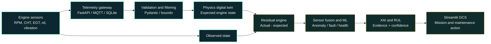

# AERIS

<p align="center">
   
</p>

<p align="center">
   <strong>Physics-anchored digital twin and predictive health platform for aero-piston engines.</strong><br />
   <a href="#quick-start-guide">Quick start</a> &nbsp;·&nbsp;
   <a href="#core-technical-capabilities">What it does</a> &nbsp;·&nbsp;
   <a href="#system-architecture">Architecture</a> &nbsp;·&nbsp;
   <a href="#rest-api-documentation">API surface</a>
</p>

<p align="center">
   
   
   
   
</p>

<p align="center">
   
   
</p>

> Built for Smart India Hackathon 2026, Problem Statement SIH26054. AERIS is a research prototype using a generic civilian/dual-use aero-piston engine model.

<details>
<summary><strong>Why AERIS?</strong></summary>

Raw thresholds are noisy. AERIS first asks what the engine should be doing under the current altitude, temperature, throttle, and load, then learns from the difference between expected and observed behavior.

$$\text{Residual} = \text{Actual Sensor Reading} - \text{Digital Twin Expected Value}$$

That residual vector powers anomaly detection, fault classification, health scoring, explainability, and remaining useful life estimates in one offline-first workflow.
</details>

---

## 🛰️ Capability Deck

<p align="center">
   
</p>

<p align="center">
   <strong>Observe → model → explain → forecast → act.</strong>
</p>

<details>
<summary><strong>Open the technical layer behind each signal</strong></summary>

| Signal layer | What AERIS does | Primary module |
| --- | --- | --- |
| Physics model | Estimates the engine state under current operating conditions | `aeris/core/physics_twin.py` |
| Residuals | Measures observed values against expected values | `aeris/core/residual_engine.py` |
| Anomalies | Scores unusual residual patterns | `aeris/ml/anomaly_detector.py` |
| Fault modes | Classifies likely failure modes and evidence | `aeris/ml/fault_classifier.py` |
| Health and RUL | Scores condition and projects remaining useful life | `aeris/core/health_index.py`, `aeris/ml/rul_estimator.py` |
| Mission operations | Replays, compares, and turns findings into maintenance context | `aeris/mission/`, `aeris/dashboard/` |
</details>

---

## 📌 Executive Summary

Modern Medium-Altitude Long-Endurance (MALE) Unmanned Aerial Vehicles (UAVs) rely on turbocharged aero-piston powerplants for high-endurance surveillance, intelligence, and reconnaissance missions. Operational safety, mission completion certainty, and predictive fleet maintenance require continuous real-time health intelligence rather than static threshold alerts.

**AERIS** is an offline-first research prototype for digital-twin-assisted engine health monitoring. Rather than feeding raw, noisy sensor data directly to machine learning models, AERIS uses a **hybrid physics-anchored architecture**:

$$\text{Residual} = \text{Actual Sensor Reading} - \text{Digital Twin Expected Value}$$

By standardizing residuals against nominal baseline physics variances, AERIS isolates true mechanical and thermodynamic degradation from normal atmospheric variations (altitude density drop, ambient temperature swings) and dynamic throttle transitions.

---

## 🏛️ System Architecture

<p align="center">
    
</p>



<details>
<summary><strong>What moves through the pipeline?</strong></summary>

`Sensors -> expected state -> residuals -> anomaly and fault evidence -> health and RUL -> operator action`

The moving signal in the diagram represents the central AERIS idea: changing
operating conditions should change the digital twin's expectation before they
are treated as a fault.
</details>

---

## ⚙️ Core Technical Capabilities

1. **Dynamic Physics Digital Twin (`aeris/core/physics_twin.py`)**:
   - Generic 4-stroke, 4-cylinder, turbocharged spark-ignition aero-piston model (~115-140 HP).
   - Models barometric lapse rate, air density ratio $\rho / \rho_0$, and turbo boost limit.
   - Computes indicated/brake thermal efficiency, fuel mass flow $\dot{m}_f$, exhaust gas energy balance ($EGT$), and dynamic cylinder head heat flux ($CHT$) with first-order thermal lag.
   - Computes lubrication circuit dynamics: gear-pump displacement vs RPM and temperature-viscosity decay.

2. **Physics-Anchored Residual Analytics (`aeris/core/residual_engine.py`)**:
   - Calculates raw residuals and normalized z-scores ($z = \frac{\Delta X}{\sigma_{baseline}}$).
   - Normalizes out ambient temperature shifts and altitude transients.

3. **Unsupervised Anomaly Detection (`aeris/ml/anomaly_detector.py`)**:
   - Isolation Forest trained strictly on nominal flight operational residuals.
   - Generates calibrated anomaly score (0.0 to 1.0) and severity classification.

4. **Multi-Class Fault Classifier (`aeris/ml/fault_classifier.py`)**:
   - Multi-class Random Forest model achieving **98% overall accuracy** and **0.97 macro F1 score** across 8 fault modes:
     1. *Misfire* (EGT drop, vibration spike, RPM roughness)
     2. *Injector Abnormality* (excess fuel flow, elevated EGT, combustion imbalance)
     3. *Lubrication Problem* (oil pressure loss, oil temperature surge)
     4. *Sensor Drift/Failure* (isolated single sensor divergence)
     5. *Combustion Instability* (cyclic torque fluctuations, vibration variance)
     6. *Overheating* (concurrent CHT and oil temperature surge)
     7. *Abnormal Vibration* (structural/propeller unbalance without thermal faults)
     8. *General Degradation* (broad gradual loss in BSFC, oil pressure, and efficiency)

5. **Cross-Sensor Consistency Checking (`aeris/ml/sensor_validator.py`)**:
   - Evaluates multi-channel thermodynamic invariants.
   - If CHT surges while EGT, oil temp, and vibration remain normal, the system flags **Sensor Drift** rather than false engine overheating.

6. **Engine Health Index (0–100) (`aeris/core/health_index.py`)**:
   - Composite index combining Thermal Health, Lubrication Health, Mechanical/Vibration Health, Efficiency Health, and Anomaly Penalties.
   - Categorized into 5 severity tiers:
     - 🟢 **90 – 100**: Healthy
     - 🔵 **70 – 89**: Normal / Watch
     - 🟡 **50 – 69**: Degraded
     - 🟠 **30 – 49**: Critical
     - 🔴 **0 – 29**: Severe

7. **Physics-Informed Remaining Useful Life (RUL) (`aeris/ml/rul_estimator.py`)**:
   - Projects wear trajectory forward to the critical overhaul threshold (Health = 30.0).
   - Calculates 90% confidence interval bounds based on operational stress acceleration.

8. **Explainable AI (XAI) (`aeris/ml/explainability.py`)**:
   - Decomposes every diagnostic conclusion into transparent attribution bars showing exact contribution percentages and physical delta values.

9. **Mission Profile Simulator & Multi-Mission Comparison (`aeris/mission/`)**:
   - Presets for Normal ISR, Long Endurance, High Altitude, Hot Weather, and Rapid Throttle Transitions.
   - Evaluates mission risk matrix (`LOW`, `MEDIUM`, `HIGH`, `CRITICAL`) with causal explanations.
   - Side-by-side multi-mission trade-off analyzer.

10. **Historical Mission Replay (`aeris/dashboard/views/replay_view.py`)**:
    - Timeline scrubber for post-flight playback with synchronized parameters and anomaly event markers.

11. **One-Click Demo Scenario (`aeris/demo/demo_scenario.py`)**:
    - Starts with nominal flight (Health 96), progressively injects fuel injector degradation, demonstrating twin divergence, anomaly alarm, health decay, and maintenance trigger.

---

## 💻 Technology Stack

- **Backend**: Python 3.10+, FastAPI, Uvicorn
- **Frontend / Ground Station**: Streamlit, Plotly
- **Machine Learning**: scikit-learn, NumPy, Pandas, SciPy, Joblib
- **Database**: SQLite (built-in, zero-configuration)
- **Telemetry Protocol**: MQTT 3.1.1 / 5.0 (Paho-MQTT with resilient in-memory fallback)
- **Testing**: Pytest, HTTPX

> **Resource note:** AERIS is intentionally designed for local or air-gapped use. The Streamlit dashboard loads scientific Python libraries, Plotly, SQLite telemetry state, and machine-learning models, so a free serverless host is not suitable for the full application. Run it locally for the complete experience.

## 📊 Replay Data And CSV Inputs

The repository includes `CSV files/CMAPSSData.zip`, an archive of the NASA Ames
C-MAPSS turbofan-engine degradation dataset. It contains the FD001-FD004
training and test files plus RUL reference files. These files are useful for
experimentation and degradation-trajectory analysis, but they are not AERIS
aero-piston telemetry columns and therefore are not drop-in inputs for the
mission replay chart without a preprocessing step.

The dashboard's **Historical Mission Replay** view is implemented in
`aeris/dashboard/views/replay_view.py`. It supports two paths:

1. Select one of the built-in generated mission logs for a ready-to-run demo.
2. Use **Or Upload Custom Mission CSV** to upload a compatible CSV from your
   own flight or transformed NASA dataset.

For the replay chart, a compatible CSV should include at least:
`timestamp_sec`, `rpm`, `cht_c`, `egt_c`, `oil_pressure_bar`, `fuel_flow_lph`,
`vibration_mms`, `is_anomaly`, and `fault_label`. Additional columns such as
`res_cht`, `res_egt`, `res_oil_p`, `res_fuel_flow`, and `res_vibration` improve
the displayed residual deltas. The uploader reads the file with Pandas and
renders it through the same replay controls as the generated data.

If you do not have a compatible file, use the sidebar's **START DEMO SCENARIO**
button or choose a generated flight in **Historical Mission Replay**. That
path requires no external dataset.

---

## 🚀 Quick Start Guide

### 1. Prerequisites & Installation

Clone the repository and install dependencies:

```bash
git clone https://github.com/nainanishourya/aeris-uav-twin.git
cd aeris-uav-twin

pip install -r requirements.txt -r requirements-dashboard.txt
```

### 2. Train Models & Verify Evaluation Metrics

Run the training pipeline to generate the synthetic corpus, train the models, and generate the evaluation report:

```bash
python -m aeris.ml.train_pipeline
```

Output:
```
Fault Classifier Accuracy: 98%
Weighted F1 Score: 98%
Anomaly Detection Precision: 94.5%
```

### 3. Launch the Ground Control Station Dashboard

Run the Streamlit operator dashboard:

```bash
streamlit run aeris/dashboard/app.py
```
For local dashboard development, open **http://localhost:8501**.

### 4. Run the REST API Backend (Optional)

In a separate terminal, launch the FastAPI server:

```bash
python scripts/run_aeris.py --mode api
```
Access the local interactive OpenAPI / Swagger documentation at
**http://localhost:8000/docs**.

### 5. Run the 1-Click Demo Scenario via CLI

To verify the injector degradation scenario in your terminal:

```bash
python -m aeris.demo.demo_scenario
```

Or click the prominent **"🚀 START DEMO SCENARIO"** button in the dashboard sidebar!

---

## 🧪 Automated Testing

Run the comprehensive pytest suite:

```bash
python -m pytest tests -v
```

All 15 automated test cases verify:
- Atmospheric physics formulas and density lapse
- Digital Twin cruise expectations and power scaling
- Residual zero-deviations and standard deviation normalization
- Isolation Forest anomaly detection
- Random Forest fault classification
- Cross-sensor drift disambiguation
- Health Index and RUL monotonicity and confidence bounds
- FastAPI REST endpoints

---

## 🌐 Free Deployment Instructions

### Deploy to Streamlit Community Cloud (Free)

1. Push your repository to GitHub.
2. Visit [share.streamlit.io](https://share.streamlit.io) and sign in with GitHub.
3. Click **"New App"** and select your repository.
4. Set **Main file path** to: `aeris/dashboard/app.py`.
5. Click **"Deploy"**!

AERIS runs completely offline and locally without paid databases, external GPUs, or proprietary cloud APIs.

---

## 📑 REST API Documentation

| Method | Endpoint | Description |
| :--- | :--- | :--- |
| `GET` | `/api/health` | Overall system health status, composite health index, and active fault |
| `GET` | `/api/telemetry/latest` | Latest physical sensor readings, twin expectations, and residuals |
| `GET` | `/api/telemetry/history` | Historical time-series telemetry records |
| `GET` | `/api/diagnostics` | Fault classification, confidence, and XAI attribution |
| `GET` | `/api/anomalies` | Active alerts and historical maintenance advisories |
| `GET` | `/api/rul` | Estimated remaining flight hours and 90% confidence bounds |
| `POST`| `/api/simulation/run` | Execute forward mission simulation and risk evaluation |
| `POST`| `/api/demo/start` | Trigger 1-click injector degradation demo sequence |
| `POST`| `/api/control/operating-point` | Set dynamic throttle, altitude, temperature, or fault injection |
| `POST`| `/api/replay/upload` | Upload custom telemetry CSV for synchronized playback |

---

## 🛡️ Disclaimer

This prototype was developed for the **Smart India Hackathon 2026 Problem Statement SIH26054 (DRDO)**. The propulsion characteristics and physics models implemented herein represent a generic civilian/dual-use aero-piston engine demonstrator. It does **not** disclose, utilize, or model classified DRDO or defence proprietary propulsion specifications.
